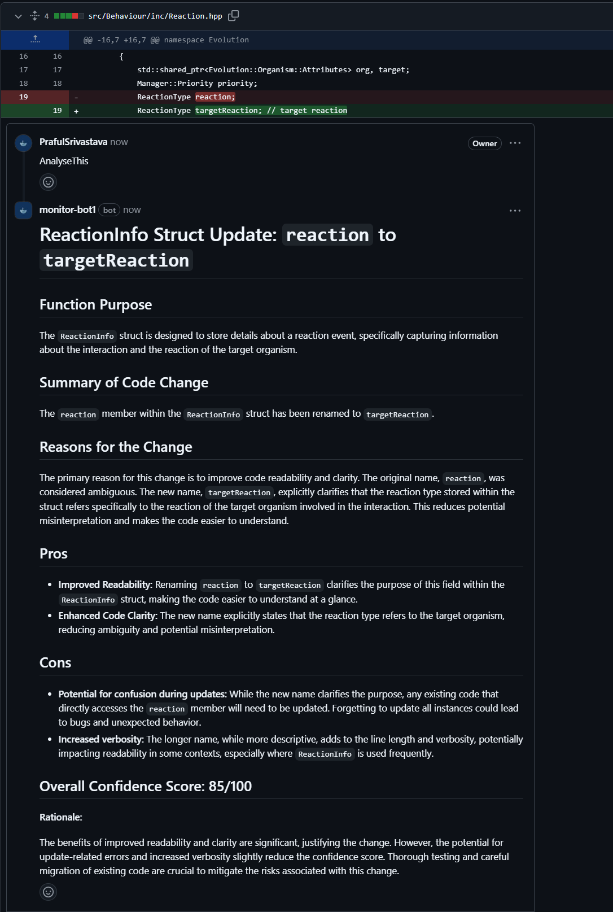

## 🕵️ ChangeReviewLogger: Ask an AI agent to review a code change

ChangeReviewLogger is an AI-powered GitHub App that listens to your pull request review comments and replies to an "AnalyseThis" request with a report detailing out the reasons and impacts of that particular code change.

## 🚀 How It Works

Every time a new review comment is added to a PR:
- The bot looks for the term "**AnalyseThis**" **(CASE SENSITIVE)**
- If found, it generates a Summary of the changes (Pros, Cons, Reasons etc) and scores the change out of 100.
- 100 means highly confident about making this change.
- 0 means dont approve this change, please.

## 📍 Where to Find the report:
- As a reply to the review comment.

## 🧩 Project Overview

This repository runs two integrated services via Docker Compose:

1. **MonitoringBot** – a [GitHub ProBot](https://probot.github.io/)-based automation bot (`/monitoring_bot`).
2. **Assistant** – a [CrewAI](https://www.crewai.com/)-based LLM agent (`/assistant`).

Both services rely on `.env` configuration files for secrets and environment variables. These files are excluded from version control for security reasons.

---

## 🛠️ Prerequisites

Before you begin, ensure you have:

- [Docker](https://docs.docker.com/get-docker/) and Docker Compose **installed and running**.
- A valid **Gemini API key** for the Assistant. [the API key is free for use]
- Create two empty .env files, one in assistant and other in monitoring_bot directories.

---

## 🧠 Configure the Assistant (LLM Service)
Create a .env file in the assistant/ directory using the following template:

```dotenv
# LLM model identifier (e.g., Gemini Flash)
MODEL=gemini/gemini-2.0-flash-001


# API key for your LLM provider
GEMINI_API_KEY=YOUR_GEMINI_API_KEY
```
---

## 🚀 Launch with Docker Compose

The root of the project contains a `docker-compose.yml` that references both services and automatically loads each `.env` file from the respective folders.

To build and start the services:

```bash
docker-compose up --build
```
---

## 🚀 Launch with Docker Compose

The root of the project contains a `docker-compose.yml` that references both services and automatically loads each `.env` file from the respective folders.

To build and start the services:

```bash
docker-compose up --build
```
---

## 🕹️ Configure the GitHub Monitoring Bot
Once the services are up, the console will display a local URL like:

```arduino
http://localhost:3000
```
👉 Follow These Steps in Your Browser:
- Open the URL above.

- Register a new GitHub App through the interface.
- During setup, select the repositories you want the bot to monitor.
- Save the configuration.
- ℹ️ This process will automatically populate environment variables inside the .env file in the monitoring_bot/ directory.
- 🔄 Restart the Server
After the .env file is updated, restart the server for changes to take effect:

```bash
docker-compose down
docker-compose up
```
---

## 🔐 Required GitHub App Permissions (Verification step, in case the end to end flow does not work)
Ensure the following permissions and event subscriptions are defined in your **app.yml** (used for GitHub App manifest creation):

```yaml
default_events:
  - commit_comment
  - issue_comment
  - issues
  - pull_request
  - pull_request_review
  - pull_request_review_comment
  - push
  - repository

default_permissions:
  issues: write
  metadata: read
  pull_requests: write
  statuses: write
```

## Example results:

